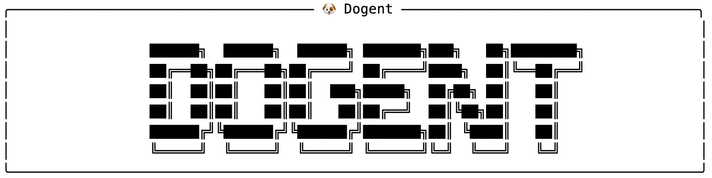

# Dogent

[English](./README.md) | [中文](./README.zh.md)



Dogent 是一个基于 Claude Agent SDK、专注于**本地文档写作**的 CLI Agent。

不同于面向编码任务的 Claude Code，Dogent 提供写作专用的系统提示词与文档模板，支持多格式文档处理与导出，提供针对文档工作流优化的 CLI 交互体验，并包含状态管理与持续改进能力。它同时保持与 Claude 生态兼容，让 AI 辅助本地文档创作更简单、更高效。

## 安装

> 需要 Python 3.10+。建议使用虚拟环境。

### 方案 A：从源码安装

```bash
# 获取源码
git clone https://github.com/MagicBowen/dogent
cd dogent

# 创建并激活虚拟环境
python -m venv .venv
source .venv/bin/activate

# 安装（可编辑模式）
pip install -e .

# 验证
dogent -v
```

### 方案 B：从 wheel 安装

从 https://github.com/MagicBowen/dogent/releases 下载最新 wheel 文件。

```bash
# 创建并激活虚拟环境
python -m venv .venv
source .venv/bin/activate

# 安装 wheel
pip install /path/to/dogent-0.9.20-py3-none-any.whl

# 验证
dogent -v
```

## 快速开始

进入工作区目录并启动 Dogent：

```bash
> cd /path/to/your/workspace
> dogent
```

在交互会话中，你可以使用 `/init` 初始化工作区，或直接开始写作：

```bash
dogent>  Use template @@built-in:technical_blog to write a technical blog about github/MagicBowen/dogent
```

在交互模式中：
- 输入 `@` 引用工作区内文件。
- 输入 `@@` 引用可用文档模板。
- 在 `/template create <需求>` 的自由文本中，同样可以继续使用 `@file` 与 `@@template` 引用上下文。
- 按 Enter 提交；Dogent 会规划任务并生成内容。
- 按 `Esc` 可中断并补充信息或调整需求。

模板工作流：
- `/template` 或 `/template list` 用于查看当前可用模板清单。
- 输入 `/template ` 时会弹出 `list`、`create`、`optimize`。
- `/template create <需求>` 会启动内置模板创建工作流。
- `/template optimize <template> [需求]` 会优化现有模板。

多行输入可按 `Ctrl+E` 打开 CLI Markdown 编辑器，编辑后按 `Ctrl+J` 提交。

使用 `/help` 查看帮助，使用 `/exit` 退出。

## 文档

完整文档位于 `docs/`（推荐阅读顺序）：

1. [docs/01-quickstart.md](docs/01-quickstart.md) - 快速开始：安装、配置、/init、首次运行
2. [docs/02-templates.md](docs/02-templates.md) - 模板：内置/全局/工作区模板与 @@ 覆盖
3. [docs/03-editor.md](docs/03-editor.md) - CLI 编辑器：多行输入、预览、保存、vi 模式
4. [docs/04-document-export.md](docs/04-document-export.md) - 文档导出与格式转换
5. [docs/05-lessons.md](docs/05-lessons.md) - 经验库（Lessons）：知识沉淀与提醒
6. [docs/06-history-and-state.md](docs/06-history-and-state.md) - history/memory/lessons 与 show/archive/clean
7. [docs/07-commands.md](docs/07-commands.md) - 命令参考：全部命令与快捷方式
8. [docs/08-configuration.md](docs/08-configuration.md) - 配置：全局/工作区、profiles、templates
9. [docs/09-permissions.md](docs/09-permissions.md) - 权限：提示与记忆规则
10. [docs/10-claude-compatibility.md](docs/10-claude-compatibility.md) - Claude 兼容性：命令/插件复用
11. [docs/11-troubleshooting.md](docs/11-troubleshooting.md) - 故障排查与调试
12. [docs/12-appendix.md](docs/12-appendix.md) - 附录：环境变量与第三方 API 设置

## License

MIT
