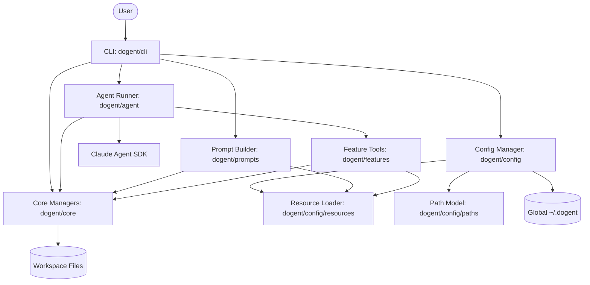
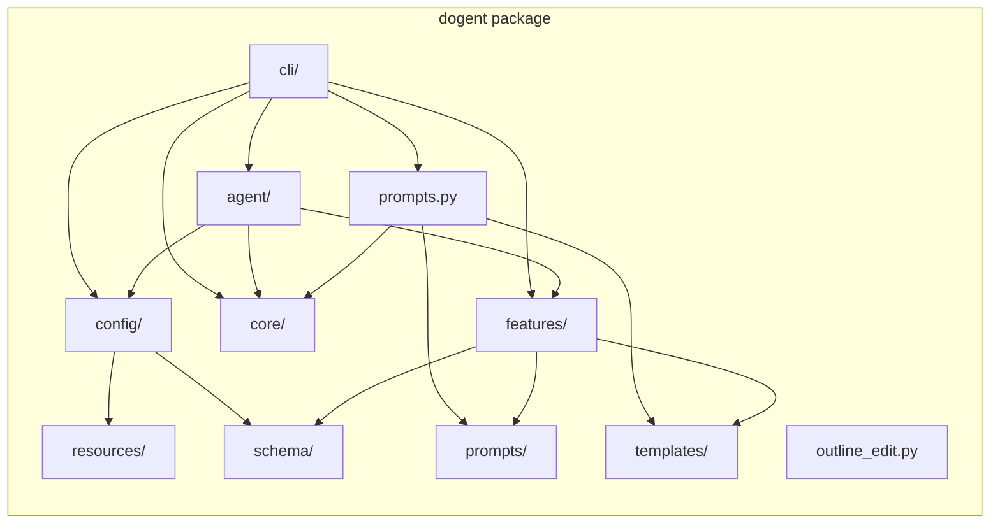

# Dogent Design

## Overview
Dogent is a CLI-first document writing agent built on the Claude Agent SDK. It combines
local workspace context, configurable profiles, and optional feature tools (document,
web, vision) to help users plan and produce documents with consistent workflows.

The design prioritizes:
- Clear module boundaries for reuse and testing.
- Centralized resource loading for bundled prompts, defaults, and schemas.
- Workspace-first behavior with optional global defaults.
- Safe tool usage with explicit permission prompts.

## Logical Architecture

## Physical Architecture

## Module Responsibilities

### dogent/cli
- Interactive loop, command registry, and prompt input handling.
- Permission prompts and confirmation dialogs.
- Startup and help panels, as well as editor integration.

### dogent/agent
- Runs the Claude Agent SDK session.
- Streams responses and handles interrupts/abort flows.
- Applies tool permission checks before tool execution.

### dogent/config
- Loads and merges workspace and global configuration.
- Provides tool configuration and SDK options.
- Centralizes resource loading paths.

### dogent/core
- Manages workspace data files (history, todos, session logs).
- Resolves file references and attachments.

### dogent/features
- Implements optional tools and feature workflows:
  - Document tools (read/convert/export).
  - Vision tools (image/video analysis).
  - Web tools (search/fetch).
  - Clarification parsing and lesson drafting.

### dogent/resources
- Bundled default configs and styles used to bootstrap the workspace.

### dogent/templates
- Built-in document templates for structured writing.

### dogent/schema
- JSON schemas for configuration and clarification payload validation.

### dogent/prompts
- Multi-line prompt templates loaded at runtime.

## Data Flow Summary
1) CLI gathers input, resolves file references, and builds prompts.
2) Agent Runner sends prompts to the Claude Agent SDK.
3) Tool calls are validated by the permission layer.
4) Core managers update history, todos, and logs.
5) Outputs are rendered back to the CLI and written to workspace files.

## Key Files and Locations
- Workspace config: `.dogent/dogent.json`
- Workspace preferences: `.dogent/dogent.md`
- Workspace history: `.dogent/history.json`
- Workspace lessons: `.dogent/lessons.md`
- Global config: `~/.dogent/dogent.json`
- Bundled defaults: `dogent/resources/`
- Bundled templates: `dogent/templates/`
- Bundled schemas: `dogent/schema/`
- Bundled prompts: `dogent/prompts/`
